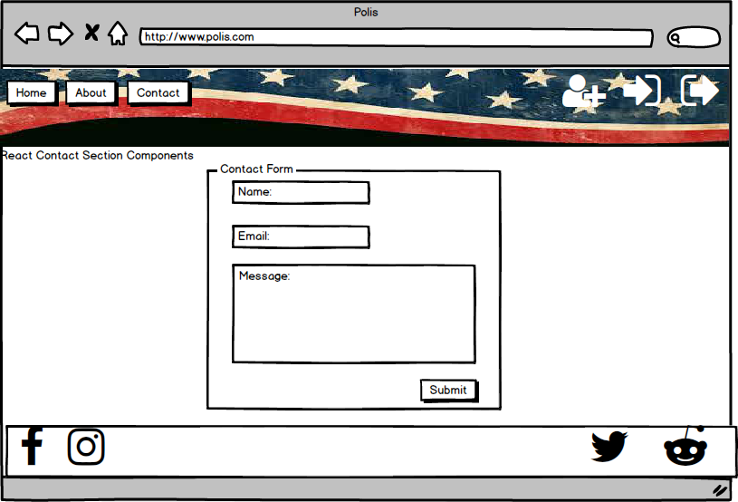

# PolisFinalProject
MERN full stack app using the MERN stack with the Vote-smart and Open Secrects APIs.

# Final Project Overview
### Overview of Intended Application
* Our application will provide voters between the ages of 18-35 quick access to information for upcoming local and national elections.
    * The information presented (if available) will focus on candidate information, voting record, etc.
        * Election information should focus on timelines, early registration opportunities, and polling locations
* Value of Application
    * We feel most voters in this demographic fail to turn out to cast their vote due to lack of readily available information
        * If we can provide that platform, it may motivate younger voters to participate more in local elections
### Roles and Responsibilities
* Rich
    * UX/UI Design
    * Mock ups
    * Frontend (Using React)
    * Backend Help once frontend is complete
* Scott
    * API Routing
    * Database Structure and Maintenance
    * Git/SCRUM Master on all commits
    * MVC Structure
    * Backend coding
* Mike
    * API information retrieval
    * QA Testing
### Timelines
* Week One
    * UX/UI and Mockups Complete
    * Basic API Routing 
    * MVC structure established
    * React Application deployed to Heroku
    * Database created and deployed with app as well
* Week Two
    * Frontend fully completed using REACT and SaSS
    * API routing completed and pushing data to React Components
    * Begin work on Presentations
* Week Three
    * QA testing and code cleanup
    * Finalizing Presentations
    * Adding extra features assuming we have complete ALL MVP portions of the project.

# Trello Project Management Board

[Trello Project Link](https://trello.com/b/1fDKIS8D/polis-project)

# UX/UI Mockups with Balsamic

## Landing Page

## About Page

## Contact Page

## Candidate Search Page

## Election Search Page

## Candidate Results Page

## Election Results Page

